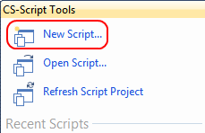
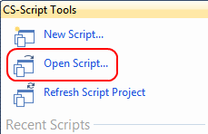
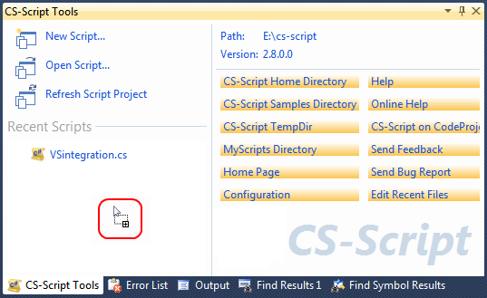
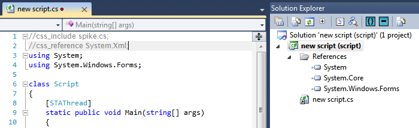
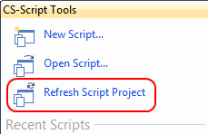
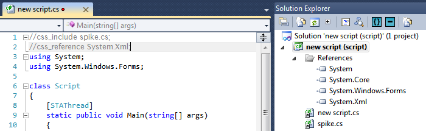
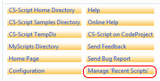
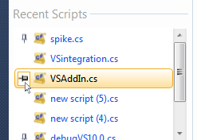
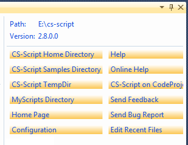

# CS-Script.VSIX

Visual Studio 2017 CS-Script Tools extension
_CS-Script Tools extension allows managing C# scripts with Visual Studio 2017._

## CS-Script Tools Tutorial

* _**Installing CS-Script Tools**_

  Install CS-Script.VSIX from Visual Studio extension manager or from Visual Studio Marketplace: https://marketplace.visualstudio.com/items?itemName=OlegShilo.CS-ScriptToolsVS2017 
   

* _**Opening CS-Script Tools window**_
  In Visual Studio select `View->Other Windows->CS-Script Tools` menu:

    

* _**Creating new script**_

  Click "New Script" command:

  
   

* _**Opening existing script**_

  - With Open File dialog

    1. Click "Open Script" command:
       
    2. The Open File dialog will popup. Navigate and select the script file. The script file will be loaded into Visual Studio.
     

  - By Drag-n-drop

    1. Drag and drop the script file anywhere in the CS-Script Tools window.
       
    2. The script file will be loaded into Visual Studio.
     

* _**Refreshing opened script references**_

  At any time you can trigger parsing CS-Script directives (//css_*) in order to update set of imported scripts and referenced assemblies. The following is a typical scenario for including spike.cs script and adding reference to System.Xml.dll assembly to the new script.cs script.

  1. Create a new script with the "New Script" command.
  2. Insert //css_include and  //css_reference directives at the top of the script:
   
  3. Click on "Refresh Script Project" command:
   
  4. The script project will be updated with one new source file and new referenced assembly:
   
     

* _**Opening script from the Recent Scripts list**_

  The appearance and the implementation of the "Recent Scripts" is very similar to the "Recent Projects" list on the "Start page" of Visual Studio. This also includes support for context menus for  script items  for  "Open Script", "Open Script Folder" and "Remove From List". This also includes "pinning" and "unpinning" items.

  You can edit "Recent Scripts" content by executing "Manage Recent Scripts" command:

  

  Click the script item in the "Recent Scripts" list to open it in Visual Studio.
  
   

* _**Executing CS-Script commands**_
  Click any of link button in the commands pane. The buttons have self explanatory captions:
  
